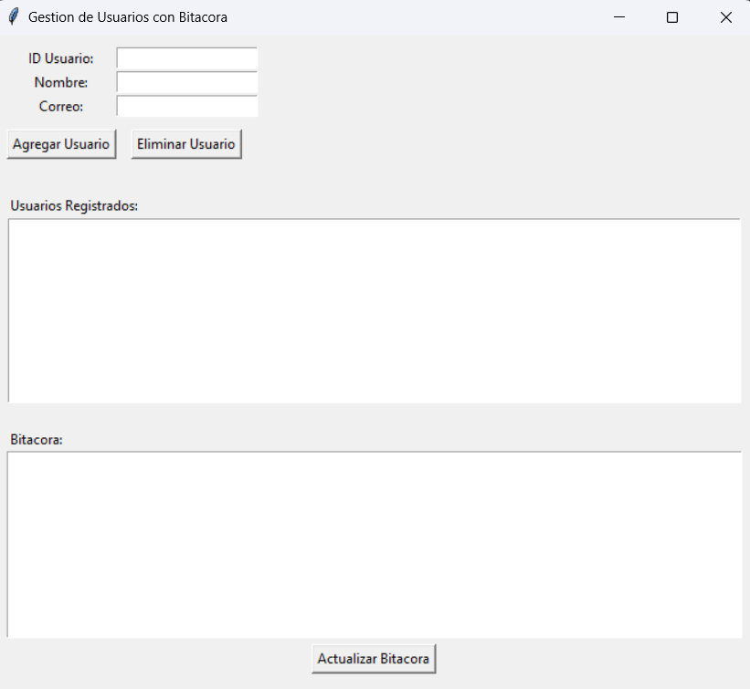

# Gestión de Usuarios con Aspect-Oriented Programming (AOP)

Este proyecto implementa un sistema de gestión de usuarios con una interfaz gráfica utilizando **Python** y **Tkinter**, demostrando la utilidad de la **Programación Orientada a Aspectos (AOP)** para manejar preocupaciones transversales como validación, auditoría y transacciones.

---

## **Características del Proyecto**
1. **Gestión de Usuarios:**
   - Crear usuarios con un ID, nombre y correo electrónico.
   - Eliminar usuarios existentes.
   - Visualizar la lista de usuarios registrados.

2. **Bitácora:**
   - Todas las acciones se registran automáticamente en un archivo de texto `bitacora.txt`.
   - Incluye información sobre transacciones, auditorías y validaciones.

3. **Interfaz Gráfica (GUI):**
   - Formulario para agregar usuarios.
   - Lista visual de usuarios registrados.
   - Visualización de la bitácora actualizada en tiempo real.

---

## **AOP en el Proyecto**

### Decoradores Implementados:
1. **`@transaction`:**
   - Registra el inicio y el resultado de cada transacción en la bitácora.
   - Permite deshacer transacciones si ocurre un error.

2. **`@audit`:**
   - Registra las acciones realizadas (crear o eliminar usuarios) junto con el identificador único del usuario.

3. **`@validate`:**
   - Verifica que los datos ingresados cumplan las reglas necesarias:
     - El nombre y correo son obligatorios.
     - No se permite duplicar usuarios por ID.

---

## **Estructura del Proyecto**
```
project/
├── bitacora.txt       # Archivo de texto donde se almacenan los logs.
├── main.py            # Archivo principal con la lógica del proyecto.
└── README.md          # Documentación del proyecto.
```

---

## **Requisitos**

- **Python 3.8 o superior**
- Bibliotecas utilizadas:
  - Tkinter (incluida en Python por defecto)

---

## **Instrucciones de Uso**

1. Clonar o descargar el repositorio:
   ```bash
   git clone https://github.com/JunalChowdhuryG/Gestion-Usuarios.git
   cd Gestion-Usuarios
   ```

2. Ejecutar el archivo principal:
   ```bash
   python main.py
   ```

3. En la interfaz gráfica:
   - Ingresa los datos del usuario (ID, Nombre, Correo) y presiona **"Agregar Usuario"**.
   - Selecciona un usuario de la lista y presiona **"Eliminar Usuario"** para eliminarlo.
   - Presiona **"Actualizar Bitácora"** para ver las acciones registradas.

---

## **Ejemplo de Bitácora**

Tras varias operaciones, el archivo `bitacora.txt` podría contener:

```plaintext
[Transacción] Inicio
[Transacción] Confirmada
[Log] Acción: Crear, Usuario ID: 1
Usuario creado: 1, Datos: {'name': 'Alice', 'email': 'alice@example.com'}

[Transacción] Inicio
[Transacción] Confirmada
[Log] Acción: Eliminar, Usuario ID: 1
Usuario eliminado: 1

[Transacción] Inicio
[Transacción] Deshecha
Error: El nombre y el correo son obligatorios. Usuario ID: 2
```

---

## **Ventajas del Enfoque AOP**

1. **Modularidad:** 
   - Separa las preocupaciones transversales como validación, auditoría y transacciones del resto de la lógica del programa.
2. **Centralización:**
   - Cambios en las reglas de validación o formato de la bitácora solo afectan a los decoradores.
3. **Reutilización:**
   - Los decoradores pueden aplicarse a otras funciones sin modificar su implementación.

---

## **Capturas de Pantalla**

### Interfaz Principal
 <!-- Reemplazar con una imagen del proyecto -->

---

